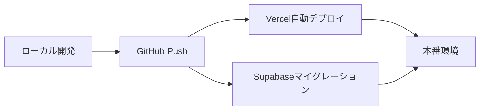

# 人生タイマー - 本番環境デプロイメントガイド

このドキュメントでは、「人生タイマー」を本番環境（Vercel + Supabase）にデプロイする手順を説明します。

## 前提条件

- GitHubアカウント（リポジトリへのプッシュ権限）
- Supabaseアカウント
- Vercelアカウント

## デプロイフロー概要



## 1. Supabase本番環境セットアップ

### 1.1 新規プロジェクト作成

1. [Supabase Dashboard](https://app.supabase.com)にログイン
2. 「New project」をクリック
3. プロジェクト情報を入力:
   - **Project name**: hito-log-prod
   - **Database Password**: 安全なパスワードを生成
   - **Region**: Tokyo (ap-northeast-1) を推奨
4. 「Create new project」をクリック

### 1.2 本番環境の接続情報取得

プロジェクト作成後、Settings > API から以下を取得:
- **Project URL**: `https://[project-id].supabase.co`
- **Anon Key**: `[本番環境のanon key]`
- **Service Role Key**: `[本番環境のservice role key]`

### 1.3 データベーススキーマの適用

```bash
# ローカル環境から本番環境へマイグレーション
supabase link --project-ref [project-id]
supabase db push
```

## 2. Vercelセットアップ

### 2.1 Vercelアカウント連携

1. [Vercel](https://vercel.com)にログイン
2. 「Add New Project」をクリック
3. GitHubアカウントを連携
4. `kj14/hito-log`リポジトリをインポート

### 2.2 環境変数設定

Vercelダッシュボードで環境変数を設定:

```
NEXT_PUBLIC_SUPABASE_URL=[本番環境のProject URL]
NEXT_PUBLIC_SUPABASE_ANON_KEY=[本番環境のanon key]
```

### 2.3 ビルド設定

- **Framework Preset**: Next.js（自動検出）
- **Build Command**: `npm run build`
- **Output Directory**: `.next`
- **Install Command**: `npm install`

### 2.4 デプロイ実行

「Deploy」ボタンをクリックして初回デプロイを実行

## 3. CI/CDパイプライン

### 3.1 自動デプロイフロー

1. `master`ブランチへのpush/merge時に自動デプロイ
2. プレビューデプロイ（PRごとに専用URL生成）
3. 本番デプロイ（masterブランチ更新時）

### 3.2 デプロイステータス確認

```bash
# Vercel CLIを使用（オプション）
npm i -g vercel
vercel
```

## 4. 独自ドメイン設定（オプション）

### 4.1 Cloudflare DNS設定

1. Cloudflareダッシュボードにログイン
2. DNSレコード追加:
   ```
   Type: CNAME
   Name: @（またはサブドメイン）
   Content: [vercel-project-name].vercel.app
   ```

### 4.2 Vercelドメイン設定

1. Vercelプロジェクト設定 > Domains
2. カスタムドメインを追加
3. DNS設定を確認

## 5. セキュリティ設定

### 5.1 Supabase Row Level Security

```sql
-- 例: ユーザーごとのデータアクセス制限
ALTER TABLE user_data ENABLE ROW LEVEL SECURITY;

CREATE POLICY "Users can only access own data" ON user_data
    FOR ALL USING (auth.uid() = user_id);
```

### 5.2 環境変数の管理

- **開発環境**: `.env.local`（gitignore対象）
- **本番環境**: Vercel環境変数
- **機密情報**: Vercelシークレット機能を使用

## 6. モニタリングとロギング

### 6.1 Vercel Analytics

- Web Vitalsの自動計測
- リアルタイムパフォーマンス監視

### 6.2 Supabase Logs

- APIリクエストログ
- データベースクエリログ
- エラートラッキング

## 7. トラブルシューティング

### よくある問題と解決策

1. **ビルドエラー**
   - `npm run build`をローカルで実行して確認
   - 環境変数の設定漏れをチェック

2. **Supabase接続エラー**
   - APIキーとURLの確認
   - CORSポリシーの設定確認

3. **PWAが動作しない**
   - HTTPSでのアクセスを確認
   - manifest.jsonとservice workerの設定確認

## 8. デプロイ後の確認事項

- [ ] 本番URLでアプリケーションが正常に表示される
- [ ] Supabaseとの接続が確立されている
- [ ] PWA機能が有効（ホーム画面追加、オフライン対応）
- [ ] パフォーマンス指標が許容範囲内
- [ ] セキュリティヘッダーが適切に設定されている

## まとめ

このガイドに従うことで、ローカル開発環境から本番環境への安全なデプロイが可能です。継続的な改善とモニタリングにより、安定したサービス提供を実現できます。